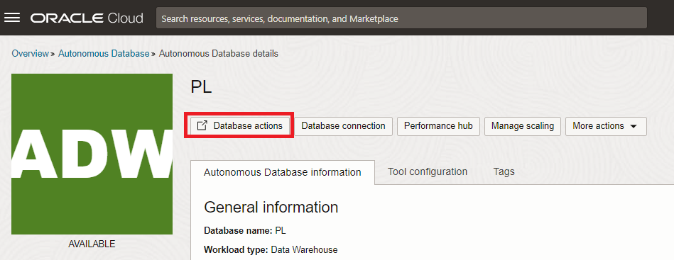
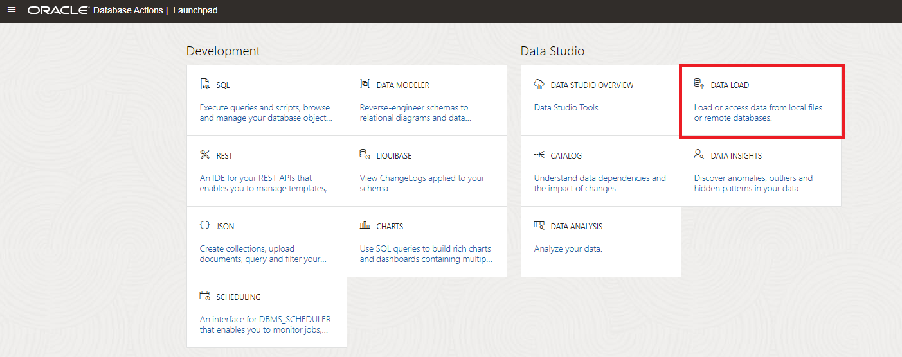
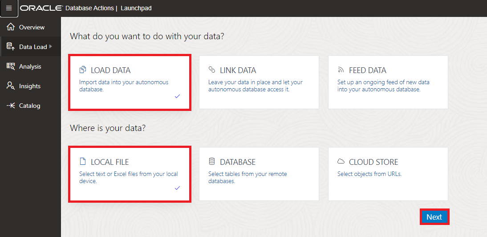
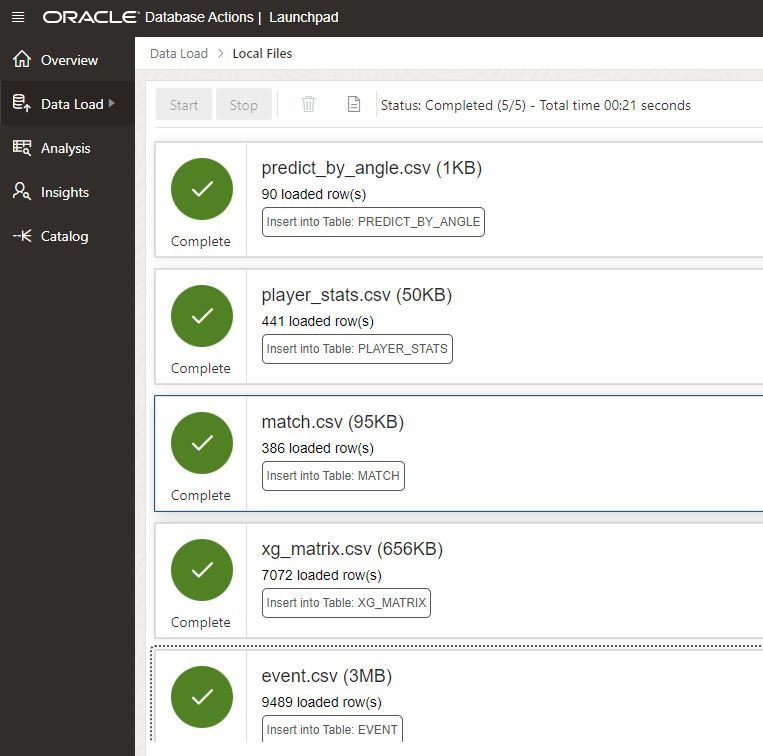

# Autonomous Data Warehouse로 데이터 로드

<!---->

## Introduction
이 실습에서는 Premier League 데이터를 Autonomous Data Warehouse에 로드합니다. 이 실습을 완료하면 데이터를 분석할 준비가 됩니다.

다음을 수행합니다:
1. 관리자 사용자로 데이터베이스 작업 섹션에 로그인합니다. 여기에서 스크립트를 실행하여 a) PL 사용자를 생성하고 b) PL 스키마에 빈 테이블 세트를 생성합니다.
2. 로그아웃한 다음 데이터베이스 작업에 PL 사용자로 다시 로그인합니다.
3. PL 사용자로 데이터를 테이블에 로드합니다.

예상 시간: 10분

### Objectives
- 데이터 웨어하우스에 데이터를 로드하는 방법을 배워서 나중에 분석할 수 있습니다.

### Prerequisites
이 실습을 완료하려면 다음이 필요합니다:
- 프로비저닝된 Autonomous Data Warehouse
- Oracle Cloud 계정에 로그인되어 있어야 합니다.

## Task 1: Autonomous Data Warehouse에서 새 데이터베이스 사용자/스키마 생성

이 새 사용자/스키마는 축구 데이터를 로딩할 것입니다.

1. 다음으로 이동하세요  **Menu** > **Oracle Database** > **Autonomous Data Warehouse**.

   

2. .이전에 생성한 **PL** 데이터베이스를 클릭하세요.

   

3. 클릭하세요  **Database Actions**.

   

   물어보면 사용자 ADMIN과 안전한 비밀번호로 로그인하세요 (이전에 Autonomous Data Warehouse를 생성할 때 지정한 것입니다).

4. **Development** 섹션에서 **SQL** 타일을 선택하세요.

    

5. [pl-create-user.sql](./files/pl-create-user.sql) 을 **다운로드**하세요. 파일을 로컬 머신에 저장하세요. 파일이 .sql 확장자로 저장되었는지 확인하세요.

6. `pl-create-user.sql` 파일을 텍스트 편집기로 열고 모든 내용을 복사하여 데이터베이스 작업 워크시트 영역에 붙여넣으세요.. 

    

7. **run-script** 버튼을 클릭하세요  (**NOT** Run 버튼이 아닙니다). 

   새 사용자 "PL"의 비밀번호를 요청받습니다. 비밀번호는 8자 이상이어야 하며, 하나의 특수 문자와 대소문자가 혼합되어야 합니다

    **Script Output** 탭에서 스크립트의 출력을 확인하세요. 출력의 마지막 줄은 스크립트가 성공적으로 실행되었음을 나타내어야 합니다.

    

## Task 2: 축구 데이터를 자율 데이터 웨어하우스로 업로드하세요

1. 분석에 사용할 5개의 데이터 파일을 **다운로드** 받으세요:

   [event.csv](https://objectstorage.eu-frankfurt-1.oraclecloud.com/p/oxJctcE-MEIjVVhjUZMhns-b5ovTAiCIEgJJG2-VxbLCQQjb34JrEiPKYV3XNiYd/n/fruktknlrefu/b/workshop-premier-league/o/event.csv) 슛 데이터에는 슛의 위치, 결과 등이 포함되어 있습니다

   [match.csv](https://objectstorage.eu-frankfurt-1.oraclecloud.com/p/RYVwaLLuK6toAlh0hVap5V6H9XGPzShRycciiWEVwFqPG9EwdkjktbFSKf_nnpkY/n/fruktknlrefu/b/workshop-premier-league/o/match.csv) 경기 데이터에는 팀 이름, 결과 등이 포함되어 있습니다.

   [predict\_by\_angle.csv](https://objectstorage.eu-frankfurt-1.oraclecloud.com/p/qjPrGmvSpo7WmTDwuafVn7mtbTCnb-8jvzQnLRaKeszyybC3hUSKPL-kfjkZwoit/n/fruktknlrefu/b/workshop-premier-league/o/predict_by_angle.csv) 슛 위치에서 골대까지 0부터 180도 사이의 각도 목록입니다.

   [xg\_matrix.csv](https://objectstorage.eu-frankfurt-1.oraclecloud.com/p/MducgpGpw2eshkApXwW9CGJfAcnprJd7MBQ1fIXHvFPDg_fc6YoFWk-t4wFqll-g/n/fruktknlrefu/b/workshop-premier-league/o/xg_matrix.csv) 미리 계산된 xG 값 목록입니다, 마지막 Lab 에서 사용합니다.

   [player\_stats.csv](https://objectstorage.eu-frankfurt-1.oraclecloud.com/p/xlcockSigxId1FV7DLDV5vVNYl_L-RbYgJxj5NqXa_HaqqOHxZSUyEPjsk6gunf5/n/fruktknlrefu/b/workshop-premier-league/o/player_stats.csv) 미리 계산된 선수 통계, 포함하여 xG를 포함한 목록입니다.

   파일을 로컬 컴퓨터에 저장하세요,  **파일이 `.csv` 확장자로 되었는지 확인하세요**

2. **Important**: 이 시점에서 **"PL" 사용자로 변경** 되었는지 확인하십시오. 이전에 "pl-create-user.sql" 스크립트를 실행할 때 이 "PL" 사용자를 생성한 것을 기억해야 합니다.    

   "Data Actions"에서 로그아웃하세요. (현재 "ADMIN"으로 표시됨)

   

   다음을 사용하여 다시 "Data Actions"에 로그인하세요:

    - Username: PL
    - Password: PL 사용자의 안전한 비밀번호를 입력하세요. 이 비밀번호는 이전에 작업 1 단계 7에서 선택한 비밀번호입니다.

3. **Data Tools** 영역 아래에 **Data Load** 옵셥을 클릭하세요    

   

4. **Load Data** 선택하세요. 첫 번째 질문에는 "Load Data"를 선택하고 두 번째 질문에는 **"Local Files"**를 선택하십시오. 그런 다음 **Next** 을 클릭하십시오.

    

5. 이전에 다운로드한 파일들(총 5개)을 선택하세요..

    

6. **각 데이터 세트**의 구성을 편집하여 로드 옵션을 "테이블에 삽입"으로 변경하세요. 이 작업을 수행하는 이유는 이전에 이미 빈 테이블을 생성했고, 해당 테이블에 데이터를 추가하고자 하기 때문입니다.

  PLAYER_STATS를 위한 지침을 보여주고 있습니다. **다른 모든 데이터 세트에 대해 동일한 작업을 수행하도록 해주세요.**

   

   

   각 파일의 옵션을 변경한 후에 **"Close"**를 누르세요

7. 모든 파일의 로드 옵션을 변경한 후에 **"Start"** 버튼을 클릭하여 프로세스를 시작하고, **Run Data Load Job** 확인 창에서 **Run**을 클릭하세요.

    

8. 이 프로세스는 일반적으로 20초에서 몇 분 정도 소요됩니다. 완료되면 모든 데이터 로드 작업 옆에 녹색 표시가 표시됩니다.

   

   축하합니다! 데이터를 자율 데이터 웨어하우스에 성공적으로 로드했습니다.

   이제 다음 랩을 진행할 수 있습니다.

## Acknowledgements

- **Author** - Jeroen Kloosterman - Technology Product Strategy Director, Sudeshni Fisher - Technology Product Strategy Manager.
- **Last Updated By/Date** - Jason Jang, July 2023
- **Korean Translator & Contributors** - Jason Jang, July 2023
